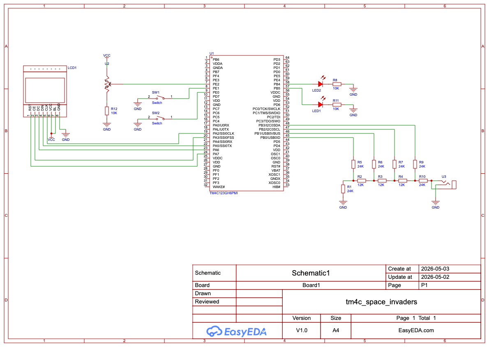

# Space Invaders Clone for the EK-TM4C123GXL development board

## Youtube Demonstration

## Wiring Diagram

## How to Flash

### Required Software

- Keil Microvision 5.43a  
  https://www.keil.com/demo/eval/arm.htm

- Stellaris ICDI Debugger  
  https://developer.arm.com/documentation/ka002280/latest

> Note: To install the Stellaris ICDI debugger, you must select the same installation directory as Keil Microvision 5.43a.

### Required Operating System

- Windows

### Flashing Instructions

1. Connect the **EK-TM4C123GXL** development board to your computer via USB. 

2. Navigate to and open: Keil/Lab15.uvprojx

using Keil Microvision.

4. Build the project (**F7**)

5. Download/flash to the board (**F8**)

## Third Party Notices

This project includes code from:

Jonathan W. Valvano
"Embedded Systems: Introduction to ARM Cortex M Microcontrollers"

This code is used under its original license (see file headers).

This project includes code from Texas Instruments (Tiva Firmware Development Package),
licensed under the BSD 3-Clause License.